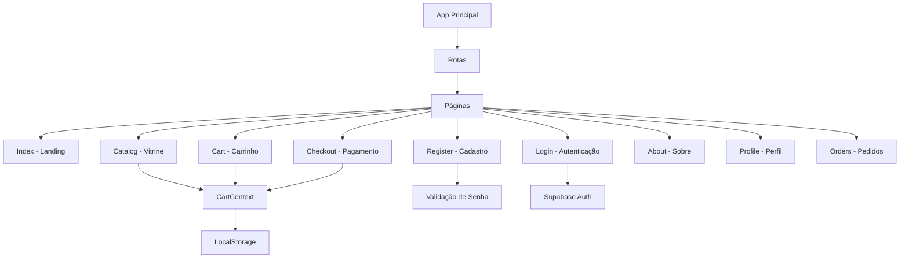
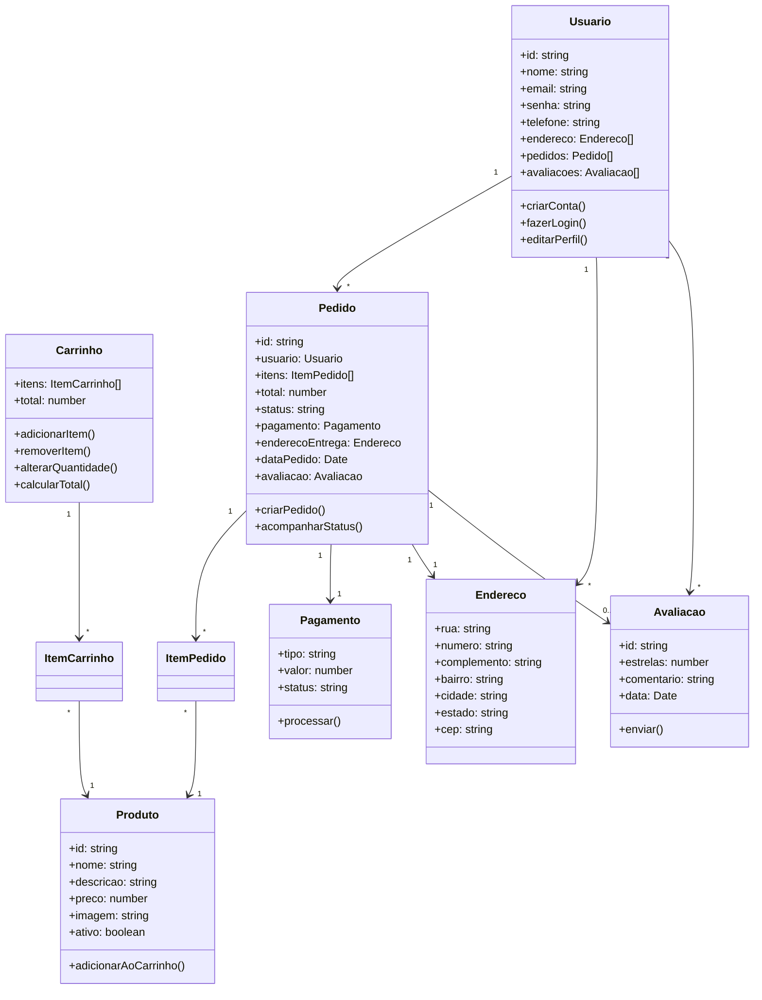
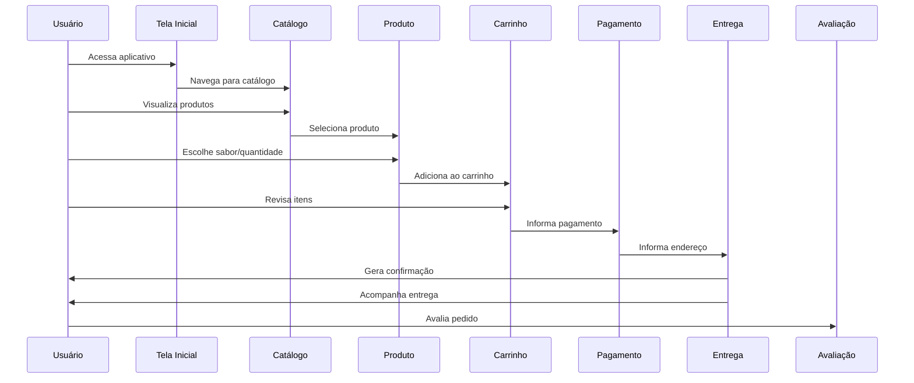
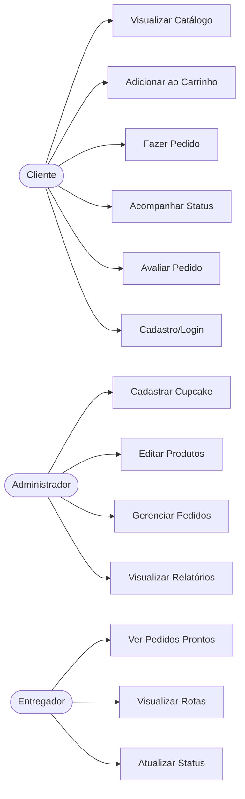
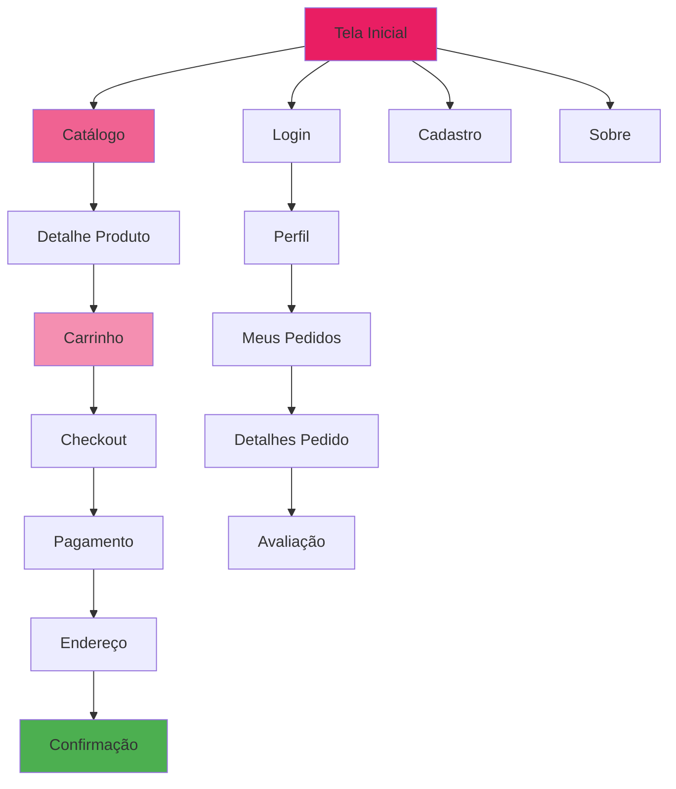

# Cruzeiro do Sul Virtual
# Educação a Distância

**Nome:** Alex Sandro de Oliveira Santos  
**RGM:** 39887111

# Projeto Integrador Transdisciplinar em Engenharia de Software I

# Apresentação do Aplicativo - Loja de Cupcake

---

## 📱 Visão Geral do Projeto

A **Loja de Cupcakes Gourmet** é um aplicativo mobile inovador desenvolvido para impulsionar vendas online, proporcionando uma experiência encantadora ao cliente desde a escolha do cupcake até a entrega. O projeto segue princípios ágeis, priorizando entregas rápidas, feedback contínuo e foco total na satisfação do usuário.

### 🎯 Objetivo Principal
Criar uma plataforma digital intuitiva e eficiente para pedidos online de cupcakes gourmet, oferecendo experiência personalizada e acompanhamento em tempo real.

### 🛠️ Tecnologias Utilizadas
- **Frontend:** React + TypeScript + Vite
- **Estilização:** Tailwind CSS + shadcn/ui
- **Backend:** Lovable Cloud (Supabase)
- **Autenticação:** Sistema integrado com validação avançada
- **PWA:** Suporte para instalação como app nativo
- **Roteamento:** React Router DOM

---

## 📸 Screenshots do Aplicativo

### 1. Tela Inicial (Landing Page)


**Descrição:** Página de boas-vindas com call-to-action para começar a navegar no catálogo ou fazer login.

---

### 2. Cadastro de Usuário


**Funcionalidades Implementadas:**
- ✅ Validação de senha com requisitos de segurança
- ✅ Mínimo de 6 caracteres
- ✅ Obrigatório caractere especial
- ✅ Bloqueio de números sequenciais (123, 321, etc.)
- ✅ Feedback visual em tempo real
- ✅ Confirmação de senha com validação

**Código de Validação:**
```typescript
const validatePassword = (password: string) => {
  return {
    minLength: password.length >= 6,
    hasSpecialChar: /[!@#$%^&*(),.?":{}|<>]/.test(password),
    noSequential: !hasSequentialNumbers(password)
  };
};
```

---

### 3. Login Seguro


**Recursos:**
- Autenticação segura
- Recuperação de senha
- Validação de credenciais
- Redirecionamento automático

---

### 4. Catálogo de Produtos


**Funcionalidades:**
- 🔍 Busca de produtos
- 💰 Exibição de preços
- 🖼️ Imagens dos cupcakes
- ➕ Botão de adicionar ao carrinho
- 📱 Layout responsivo

**Produtos Disponíveis:**
- Chocolate - R$ 5,50
- Morango - R$ 6,00
- Baunilha - R$ 4,50
- Caramelo - R$ 5,00
- Red Velvet - R$ 7,00
- Limão - R$ 5,50

---

### 5. Carrinho de Compras


**Recursos:**
- Visualização de itens
- Alteração de quantidade
- Remoção de produtos
- Cálculo automático do total
- Botão para finalizar compra

---

### 6. Página Sobre


**Informações:**
- 🎂 Receitas Artesanais
- ❤️ Feito com Amor
- 🏆 Qualidade Premium

---

## 🎨 Arquitetura do Sistema

### Diagrama de Componentes



### Diagrama de Classes



### Diagrama de Sequência - Fluxo de Compra



### Diagrama de Casos de Uso



### Mapa Navegacional



---

## 📋 Histórias de Usuário

### 🍰 HU01 | Vitrine Encantada

**Usuário:** Cliente  
**Objetivo:** Visualizar todos os cupcakes disponíveis com fotos, descrições e preços.  
**Detalhe:** Primeira tela do app, visual atrativo e navegação intuitiva.

**Critérios de Aceitação:**
- ✅ Exibe todos os cupcakes cadastrados
- ✅ Cada cupcake tem foto, nome, descrição e preço
- ✅ Apenas cupcakes ativos aparecem
- ✅ Carregamento em até 2 segundos

**Regra de Negócio:** Apenas cupcakes ativos aparecem  
**Requisito Não Funcional:** Carregamento em até 2 segundos  
**Prioridade:** 🟢 Alta  
**Pontos:** 3

---

### 🛒 HU02 | Adicionar ao Carrinho

**Usuário:** Cliente  
**Objetivo:** Selecionar cupcake e adicionar ao carrinho, escolhendo quantidade.  
**Detalhe:** Botão de ação rápido, feedback visual.

**Critérios de Aceitação:**
- ✅ Adiciona qualquer cupcake ao carrinho
- ✅ Escolhe quantidade
- ✅ Não permite quantidade negativa

**Requisito Não Funcional:** Operação em até 1 segundo  
**Prioridade:** 🟢 Alta  
**Pontos:** 2

---

### 🧁 HU03 | Personalização do Pedido

**Usuário:** Cliente  
**Objetivo:** Escolher sabores e adicionais para cada cupcake.  
**Detalhe:** Adicionais exibidos com ícones e preços extras.

**Critérios de Aceitação:**
- Seleciona sabores disponíveis
- Adiciona coberturas/extras
- Preço atualizado em tempo real

**Requisito Não Funcional:** Interface responsiva e touch-friendly  
**Prioridade:** 🟢 Alta  
**Pontos:** 3

---

### 📦 HU04 | Revisão do Carrinho

**Usuário:** Cliente  
**Objetivo:** Visualizar e editar itens do carrinho antes de finalizar.  
**Detalhe:** Permite remover ou alterar quantidade com gestos.

**Critérios de Aceitação:**
- ✅ Lista de cupcakes no carrinho
- ✅ Remover/alterar quantidade facilmente
- ✅ Valor total atualizado automaticamente

**Prioridade:** 🟢 Alta  
**Pontos:** 2

---

### 👤 HU05 | Cadastro Rápido

**Usuário:** Cliente  
**Objetivo:** Criar conta com nome, e-mail, telefone e endereço.  
**Detalhe:** Cadastro simplificado, validação automática.

**Critérios de Aceitação:**
- ✅ Preenche todos os campos obrigatórios
- ✅ Validação de e-mail e telefone
- ✅ Validação avançada de senha:
  - Mínimo 6 caracteres
  - Caractere especial obrigatório
  - Bloqueio de números sequenciais

**Regra de Negócio:** Não permite e-mail duplicado  
**Requisito Não Funcional:** Dados criptografados  
**Prioridade:** 🟢 Alta  
**Pontos:** 2

---

### 🔑 HU06 | Login Seguro

**Usuário:** Cliente  
**Objetivo:** Fazer login com e-mail e senha, com opção de recuperar senha.  
**Detalhe:** Tela moderna, login social opcional.

**Critérios de Aceitação:**
- ✅ Login com dados válidos
- ✅ Recuperação de senha disponível
- ✅ Bloqueio após 5 tentativas erradas

**Requisito Não Funcional:** Autenticação segura  
**Prioridade:** 🟢 Alta  
**Pontos:** 2

---

### 💳 HU07 | Pagamento Flexível

**Usuário:** Cliente  
**Objetivo:** Selecionar entre cartão, débito ou Pix.  
**Detalhe:** Exibe bandeiras e QR Code para Pix.

**Critérios de Aceitação:**
- Escolhe forma de pagamento
- Pagamento processado com segurança
- Confirmação antes de gerar pedido

**Requisito Não Funcional:** Integração com gateways  
**Prioridade:** 🟢 Alta  
**Pontos:** 3

---

### 📩 HU08 | Confirmação Instantânea

**Usuário:** Cliente  
**Objetivo:** Receber notificação de confirmação após pagamento.  
**Detalhe:** Notificação push e e-mail com resumo do pedido.

**Critérios de Aceitação:**
- Confirmação imediata
- Detalhes do pedido na notificação
- Só após pagamento aprovado

**Requisito Não Funcional:** Notificações em tempo real  
**Prioridade:** 🟢 Alta  
**Pontos:** 2

---

### 🚚 HU09 | Acompanhar Pedido em Tempo Real

**Usuário:** Cliente  
**Objetivo:** Visualizar status do pedido (produção, entrega, entregue).  
**Detalhe:** Linha do tempo animada do pedido.

**Critérios de Aceitação:**
- Status atualizado em tempo real
- Notificação a cada mudança de status
- Só admin/entregador altera status

**Requisito Não Funcional:** Atualização automática  
**Prioridade:** 🟢 Alta  
**Pontos:** 3

---

### ⭐ HU10 | Avaliação do Pedido

**Usuário:** Cliente  
**Objetivo:** Avaliar pedido após entrega (1 a 5 estrelas e comentário).  
**Detalhe:** Interface amigável e gamificada.

**Critérios de Aceitação:**
- Avaliação e comentário disponíveis
- Avaliação visível para admin
- Só avalia pedidos entregues

**Prioridade:** 🟡 Média  
**Pontos:** 2

---

### 🎁 HU11 | Receber Promoções

**Usuário:** Cliente  
**Objetivo:** Receber notificações de promoções e novidades.  
**Detalhe:** Push, e-mail e banner no app.

**Critérios de Aceitação:**
- Recebe promoções cadastradas pelo admin
- Cliente pode desativar notificações

**Prioridade:** 🟡 Média  
**Pontos:** 2

---

### 🧑‍🍳 HU12 | Cadastro de Cupcake

**Usuário:** Administrador  
**Objetivo:** Adicionar novo cupcake à vitrine.  
**Detalhe:** Upload de foto com preview.

**Critérios de Aceitação:**
- Cadastro completo com foto, descrição e preço
- Só aparece após cadastro completo

**Requisito Não Funcional:** Upload otimizado  
**Prioridade:** 🟢 Alta  
**Pontos:** 2

---

### 📝 HU13 | Edição e Remoção de Cupcake

**Usuário:** Administrador  
**Objetivo:** Editar ou remover cupcake da vitrine.  
**Detalhe:** Bloqueio se houver pedidos em andamento.

**Critérios de Aceitação:**
- Edita ou remove cupcakes facilmente
- Não remove se houver pedidos pendentes

**Requisito Não Funcional:** Operação auditável  
**Prioridade:** 🟢 Alta  
**Pontos:** 2

---

### 📊 HU14 | Gestão de Pedidos

**Usuário:** Administrador  
**Objetivo:** Visualizar todos os pedidos feitos pelos clientes.  
**Detalhe:** Filtros por status e cliente.

**Critérios de Aceitação:**
- Lista de pedidos em ordem cronológica
- Permite filtrar por status

**Requisito Não Funcional:** Interface clara e rápida  
**Prioridade:** 🟢 Alta  
**Pontos:** 2

---

### 🚙 HU15 | Entregas Inteligentes

**Usuário:** Entregador  
**Objetivo:** Visualizar pedidos prontos para entrega e endereços.  
**Detalhe:** Mapa com rota sugerida.

**Critérios de Aceitação:**
- Lista de pedidos prontos
- Endereço e rota disponíveis
- Só pedidos pagos aparecem

**Requisito Não Funcional:** Integração com mapas  
**Prioridade:** 🟢 Alta  
**Pontos:** 3

---

## 📊 Backlog do Produto Priorizado

| Prioridade | ID     | História do Usuário                                           | Pontos | Status |
|------------|--------|---------------------------------------------------------------|--------|--------|
| 🟢 Alta    | HU01   | Visualizar cupcakes com fotos, descrições e preços            | 3      | ✅ Concluído |
| 🟢 Alta    | HU02   | Adicionar cupcakes ao carrinho, escolhendo quantidade         | 2      | ✅ Concluído |
| 🟢 Alta    | HU03   | Personalizar pedido com sabores e adicionais                  | 3      | 🔄 Em Progresso |
| 🟢 Alta    | HU04   | Visualizar e editar itens do carrinho                         | 2      | ✅ Concluído |
| 🟢 Alta    | HU05   | Criar conta com nome, e-mail, telefone e endereço             | 2      | ✅ Concluído |
| 🟢 Alta    | HU06   | Login seguro com opção de recuperar senha                     | 2      | ✅ Concluído |
| 🟢 Alta    | HU07   | Escolher entre cartão, débito ou Pix                          | 3      | 🔄 Em Progresso |
| 🟢 Alta    | HU08   | Receber notificação de confirmação após pagamento             | 2      | ⏳ Planejado |
| 🟢 Alta    | HU09   | Acompanhar status do pedido em tempo real                     | 3      | ⏳ Planejado |
| 🟡 Média   | HU10   | Avaliar pedido após entrega                                   | 2      | ⏳ Planejado |
| 🟡 Média   | HU11   | Receber notificações de promoções e novidades                 | 2      | ⏳ Planejado |
| 🟢 Alta    | HU12   | Cadastrar novos cupcakes na vitrine                           | 2      | ⏳ Planejado |
| 🟢 Alta    | HU13   | Editar ou remover cupcakes da vitrine                         | 2      | ⏳ Planejado |
| 🟢 Alta    | HU14   | Visualizar todos os pedidos com filtros                       | 2      | ⏳ Planejado |
| 🟢 Alta    | HU15   | Visualizar pedidos prontos para entrega e rotas               | 3      | ⏳ Planejado |

**Total de Pontos:** 35  
**Concluído:** 13 pontos (37%)  
**Em Progresso:** 6 pontos (17%)  
**Planejado:** 16 pontos (46%)

---

## 🎯 Mapa de Afinidade das Histórias

### 🍰 Experiência do Cliente

#### 🎨 Vitrine & Carrinho
- HU01: Vitrine Encantada ✅
- HU02: Adicionar ao Carrinho ✅
- HU03: Personalização do Pedido 🔄
- HU04: Revisão do Carrinho ✅

#### 👤 Cadastro & Login
- HU05: Cadastro Rápido ✅
- HU06: Login Seguro ✅

#### 💳 Pagamento & Confirmação
- HU07: Pagamento Flexível 🔄
- HU08: Confirmação Instantânea ⏳

#### 🚚 Acompanhamento & Avaliação
- HU09: Acompanhar Pedido em Tempo Real ⏳
- HU10: Avaliação do Pedido ⏳

#### 🎁 Promoções
- HU11: Receber Promoções ⏳

### 🔧 Gestão Interna & Entrega

#### 🧑‍🍳 Administração de Produtos
- HU12: Cadastro de Cupcake ⏳
- HU13: Edição e Remoção de Cupcake ⏳

#### 📊 Administração de Pedidos
- HU14: Gestão de Pedidos ⏳

#### 🚙 Entrega
- HU15: Entregas Inteligentes ⏳

---

## 🔐 Validação de Senha - Detalhamento Técnico

### Requisitos Implementados

1. **Mínimo de 6 Dígitos**
   - Validação: `password.length >= 6`
   - Feedback visual em tempo real

2. **Caractere Especial Obrigatório**
   - Regex: `/[!@#$%^&*(),.?":{}|<>]/`
   - Aceita: `! @ # $ % ^ & * ( ) , . ? " : { } | < >`

3. **Bloqueio de Números Sequenciais**
   - Detecta: 123, 234, 345, 321, 432, etc.
   - Algoritmo de verificação em três dígitos consecutivos

### Algoritmo de Detecção de Sequências

```typescript
const hasSequentialNumbers = (str: string) => {
  for (let i = 0; i < str.length - 2; i++) {
    const char1 = str[i];
    const char2 = str[i + 1];
    const char3 = str[i + 2];
    
    if (/\d/.test(char1) && /\d/.test(char2) && /\d/.test(char3)) {
      const num1 = parseInt(char1);
      const num2 = parseInt(char2);
      const num3 = parseInt(char3);
      
      // Sequência crescente (123, 234, etc.)
      if (num2 === num1 + 1 && num3 === num2 + 1) {
        return true;
      }
      
      // Sequência decrescente (321, 432, etc.)
      if (num2 === num1 - 1 && num3 === num2 - 1) {
        return true;
      }
    }
  }
  return false;
};
```

### Exemplos de Senhas

| Senha | Válida? | Motivo |
|-------|---------|--------|
| `abc123` | ❌ | Contém sequência 123 |
| `Pass@123` | ❌ | Contém sequência 123 |
| `Pass@135` | ✅ | Não há sequência, tem especial, 8 chars |
| `senha` | ❌ | Sem caractere especial, menos de 6 |
| `Sen@ha` | ✅ | Atende todos os requisitos |
| `Test321!` | ❌ | Contém sequência 321 |

---

## 🏗️ Estrutura do Projeto

```
cupcake-shop/
├── src/
│   ├── assets/
│   │   └── cupcake-hero.jpg
│   ├── components/
│   │   ├── ui/
│   │   │   ├── button.tsx
│   │   │   ├── card.tsx
│   │   │   ├── input.tsx
│   │   │   └── ... (outros componentes)
│   │   └── BottomNav.tsx
│   ├── data/
│   │   └── cupcakes.ts
│   ├── hooks/
│   │   ├── use-mobile.tsx
│   │   └── use-toast.ts
│   ├── integrations/
│   │   └── supabase/
│   │       ├── client.ts
│   │       └── types.ts
│   ├── lib/
│   │   ├── cart-context.tsx
│   │   └── utils.ts
│   ├── pages/
│   │   ├── Index.tsx
│   │   ├── Catalog.tsx
│   │   ├── Cart.tsx
│   │   ├── Register.tsx
│   │   ├── Login.tsx
│   │   ├── Checkout.tsx
│   │   ├── About.tsx
│   │   ├── Profile.tsx
│   │   ├── Orders.tsx
│   │   └── OrderStatus.tsx
│   ├── types/
│   │   └── index.ts
│   ├── App.tsx
│   ├── index.css
│   └── main.tsx
├── public/
│   ├── manifest.json
│   ├── icon-192x192.png
│   ├── icon-512x512.png
│   └── robots.txt
├── supabase/
│   └── config.toml
└── package.json
```

---

## 🚀 Funcionalidades Técnicas Implementadas

### ✅ Autenticação e Segurança
- Sistema de autenticação integrado
- Validação avançada de senha
- Criptografia de dados sensíveis
- Proteção contra ataques comuns

### ✅ Gerenciamento de Estado
- Context API para carrinho
- LocalStorage para persistência
- Estado global compartilhado

### ✅ PWA (Progressive Web App)
- Instalável como app nativo
- Funciona offline
- Service Worker configurado
- Manifesto completo

### ✅ Responsividade
- Layout adaptativo
- Mobile-first design
- Breakpoints configurados
- Touch-friendly

### ✅ Performance
- Lazy loading de componentes
- Otimização de imagens
- Code splitting
- Cache estratégico

---

## 📈 Métricas e KPIs

### Objetivos de Performance
- ⚡ **Carregamento Inicial:** < 2 segundos
- ⚡ **Time to Interactive:** < 3 segundos
- ⚡ **First Contentful Paint:** < 1 segundo

### Objetivos de Negócio
- 📊 **Taxa de Conversão:** > 5%
- 📊 **Ticket Médio:** R$ 25,00
- 📊 **Retenção de Usuários:** > 40%
- 📊 **NPS (Net Promoter Score):** > 50

---

## 🔄 Roadmap Futuro

### Fase 1 - Concluída ✅
- [x] Estrutura básica do aplicativo
- [x] Sistema de autenticação
- [x] Catálogo de produtos
- [x] Carrinho de compras
- [x] Validação avançada de senha

### Fase 2 - Em Andamento 🔄
- [ ] Sistema de pagamento integrado
- [ ] Checkout completo
- [ ] Personalização de pedidos

### Fase 3 - Planejada ⏳
- [ ] Acompanhamento em tempo real
- [ ] Sistema de avaliações
- [ ] Notificações push
- [ ] Painel administrativo

### Fase 4 - Futuro 🔮
- [ ] Programa de fidelidade
- [ ] Chat com atendimento
- [ ] Recomendações personalizadas
- [ ] Integração com redes sociais

---

## 📝 Conclusão

O aplicativo **Cupcake Shop** representa uma solução completa e moderna para vendas online de cupcakes gourmet. Com uma arquitetura robusta, interface intuitiva e funcionalidades avançadas de segurança, o projeto está alinhado com as melhores práticas de desenvolvimento web atual.

### Diferenciais Técnicos
- ✨ **Validação avançada de senha** com bloqueio de sequências
- ✨ **PWA** instalável como app nativo
- ✨ **Arquitetura escalável** com separação de responsabilidades
- ✨ **Design system** consistente com Tailwind + shadcn/ui
- ✨ **TypeScript** para maior segurança e produtividade

### Próximos Passos
1. Implementar sistema de pagamento completo
2. Desenvolver painel administrativo
3. Integrar sistema de notificações em tempo real
4. Adicionar tracking de entregas
5. Implementar sistema de avaliações

---

## 📞 Contato

**Desenvolvedor:** Alex Sandro de Oliveira Santos  
**RGM:** 39887111  
**Instituição:** Cruzeiro do Sul Virtual  
**Curso:** Engenharia de Software I

---

**Data de Criação:** 2024  
**Última Atualização:** Novembro 2025  
**Versão:** 2.0
